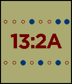

Pebble Hex Time
===============

Download from [apps.rebble.io](https://apps.rebble.io/application/5590679e66735def770000a1)

Hex Time is a watchface for the [Pebble](https://en.wikipedia.org/wiki/Pebble_(watch)) smart watch that displays the time in hexadecimal. It's written C and uses the Pebble SDK. Orginally developed and published to the Pebble app store in 2015.

I wrote the code after winning a Pebble at a the [Bluemix IoT and Drones Hackathon during Devoxx London 2015](http://heidloff.net/article/06222015125447PMNHEETB.htm).

Unfortunately in 2016 Pebble Technology filed for insolvency but the app can still be downloaded thanks to the awesome work by [rebble.io](https://rebble.io/).
